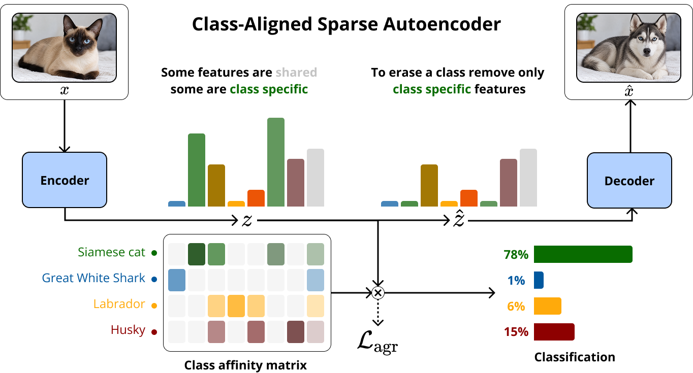

<div align="center">

# ClasSAE: Class-Aligned Sparse Autoencoders via Differentiable Feature-Class Affinity

[](https://arxiv.org/abs/XXXX.XXXXX)
[](https://www.python.org/)
[](https://pytorch.org/)
[](LICENSE)

<br/>

**Jakub Stępień**<sup>1</sup> &nbsp;·&nbsp; **Marcin Mazur**<sup>1</sup> &nbsp;·&nbsp; **Jacek Tabor**<sup>1</sup> &nbsp;·&nbsp; **Przemysław Spurek**<sup>1,2</sup>

<sup>1</sup>Jagiellonian University &nbsp;&nbsp; <sup>2</sup>IDEAS Research Institute

<br/>

<!-- Replace with your teaser figure -->


*ClasSAE jointly learns a sparse dictionary and a class affinity matrix, enabling classifier-free class prediction and targeted editing: removing only the features exclusive to a class erases that class from the reconstruction while shared features are preserved.*

</div>

---

## Overview

Sparse Autoencoders (SAEs) are increasingly used not only for passive interpretability analysis but also for active interventions such as unlearning, bias mitigation, and concept editing. These methods require reliably matching features to target concepts — a step that current approaches handle by computing post-hoc scores over an already-trained, frozen dictionary.

**ClasSAE** takes a different approach: it simultaneously *assigns classes to features* and *guides the encoder toward class-separable representations* during training. The key mechanism is a differentiable top-k operator applied to a trainable feature–class affinity matrix with per-feature budgets. Gradients flow through the selection of active features rather than only through their magnitudes, so the encoder and the affinity matrix co-adapt in a single end-to-end training pass.

The result is a dictionary that is both class-separable and class-annotated, with no post-hoc probing required.

### Key contributions

- **Automatic feature–class association** via a jointly trained affinity matrix M
- **Class-aligned encoder–decoder** shaped by the agreement loss during training, not post-hoc
- **Three sparsity variants** (Soft-gradient BatchTopK, Hard BatchTopK, L¹-relaxed) with comparable performance and different trade-offs
- **Out-of-the-box classifier**: the pair (SAE, M) acts as a ready-to-use classifier with no additional fitting
- **Theoretical grounding**: the optimal M converges to a PMI-thresholding rule (Proposition 2)

---

## Results

All experiments use CLIP ViT-L/14 embeddings on ImageNet-1k, dictionary size d = 16 384, 5 seeds.

| Method | FVE ↑ | Alive ↑ | M-Honesty F1 ↑ | Top-1 Acc ↑ | TPP PMI ↑ | Edit Strength ↓ |
|---|---|---|---|---|---|---|
| BatchTopK | 0.973 | 0.713 | 0.346 | 0.002 | 0.277 | 70.850 |
| JumpReLU | **0.986** | 0.579 | 0.463 | 0.678 | 0.453 | 87.082 |
| Standard | 0.899 | 0.671 | 0.682 | 0.760 | 0.430 | 62.379 |
| ClasSAE | 0.934 | **1.000** | 0.807 | 0.750 | 0.462 | 33.816 |
| ClasSAE Hard | 0.910 | **1.000** | **0.851** | 0.789 | 0.469 | **23.470** |
| ClasSAE L¹ | 0.864 | **1.000** | 0.796 | **0.799** | **0.475** | 23.842 |

**Recommended variant: ClasSAE Hard** — best balance across annotation faithfulness, classification accuracy, and TPP at large k, with the smallest edit strength.

---

## Repository Structure

```
classae/
├── src/classae/                  # Main Python package
│   ├── sae/                      # SAE model implementations
│   │   ├── classae.py                   # ClasSAE (soft-gradient BatchTopK)
│   │   ├── classae_no_soft.py           # ClasSAE Hard variant
│   │   ├── classae_no_topk.py           # ClasSAE L¹ variant
│   │   ├── batch_topk.py                # BatchTopK baseline
│   │   ├── matryoshka_batch_topk.py     # Matryoshka BatchTopK baseline
│   │   ├── topk.py                      # TopK baseline
│   │   ├── standard.py                  # Standard SAE (L¹)
│   │   ├── jumprelu.py                  # JumpReLU baseline
│   │   ├── top_afa.py                   # Top-AFA baseline
│   │   ├── core.py                      # Shared SAE base class
│   │   └── config.py                    # Hydra config schemas
│   ├── cmd/                             # Entry points
│   │   ├── train.py                     # Training (Hydra)
│   │   ├── tpp.py                       # Targeted Probe Perturbation evaluation
│   │   ├── reconstruction.py            # Reconstruction quality evaluation
│   │   ├── unlearning.py                # Unlearning benchmark
│   │   ├── m_honesty.py                 # M-honesty metric
│   │   ├── empirical_honesty.py         # Empirical honesty metric
│   │   ├── empirical_m_classifier.py    # Out-of-the-box classification
│   │   ├── probing.py                   # Linear probing
│   │   ├── precompute_clip.py           # Precompute CLIP activations
│   │   ├── precompute_dino.py           # Precompute DINOv3 activations
│   │   └── precompute_matrix.py         # Precompute PMI matrix
│   ├── eval/                            # Evaluation utilities
│   │   ├── pmi.py                       # PMI computation
│   │   ├── posthoc_M.py                 # Post-hoc affinity matrix
│   │   └── matrix_honesty.py            # Honesty metrics
│   ├── dataset.py                # Dataset loading
│   ├── labels.py                 # ImageNet label utilities
│   └── const.py                  # Global constants
├── config/                       # Hydra YAML configurations
│   ├── train.yaml                # Top-level training config
│   ├── sae/                      # Per-architecture configs
│   │   ├── classae.yaml
│   │   ├── batch_topk.yaml
│   │   ├── jumprelu.yaml
│   └── └── ...
├── packages/LapSum/              # Vendored LapSum library (differentiable top-k)
├── notebooks/                    # Plots & Visualisations utilities
│   ├── eval.ipynb                
│   ├── heatmaps.ipynb            
└── └── simple.ipynb             
```

---

## Installation

**Prerequisites:** Python 3.13+, CUDA-capable GPU (experiments run on NVIDIA GH200).

```bash
git clone https://github.com/YOUR_USERNAME/classae.git
cd classae

# Install with uv (recommended)
pip install uv
uv sync

# Or with pip
pip install -e .
pip install git+https://github.com/openai/CLIP.git
```

The vendored [LapSum](packages/LapSum/) library (differentiable top-k / sorting) is installed automatically as a local dependency.

---

## Usage

### 1. Precompute activations

```bash
# CLIP ViT-L/14 on ImageNet
python -m classae.cmd.precompute_clip

# DINOv3 patch tokens
python -m classae.cmd.precompute_dino
```

### 2. Train a model

Training uses [Hydra](https://hydra.cc/) for configuration management:

```bash
# ClasSAE (soft-gradient BatchTopK) — recommended default
python -m classae.cmd.train sae=classae

# ClasSAE Hard
python -m classae.cmd.train sae=classae_no_soft

# ClasSAE L¹
python -m classae.cmd.train sae=classae_no_topk

# Baselines
python -m classae.cmd.train sae=batch_topk
python -m classae.cmd.train sae=jumprelu
python -m classae.cmd.train sae=topk
python -m classae.cmd.train sae=standard
python -m classae.cmd.train sae=matryoshka_batch_topk
python -m classae.cmd.train sae=top_afa
```

Hydra config overrides work as usual:

```bash
python -m classae.cmd.train sae=classae sae.mu=0.2 sae.rho=40 wandb=default
```

### 3. Evaluate

Evaluation scripts use standard argparse. Pass `--help` to any script to see its arguments.

```bash
# M-honesty (Table 2)
python -m classae.cmd.m_honesty --checkpoint PATH

# Out-of-the-box classification (Table 3)
python -m classae.cmd.empirical_m_classifier --checkpoint PATH

# Targeted Probe Perturbation (Table 4)
python -m classae.cmd.tpp --checkpoint PATH

# Unlearning benchmark (Table 5)
python -m classae.cmd.unlearning --checkpoint PATH

# Reconstruction quality (Table 1)
python -m classae.cmd.reconstruction --checkpoint PATH

# Linear probing
python -m classae.cmd.probing --checkpoint PATH
```

---

## Hyperparameters

| Hyperparameter | Value |
|---|---|
| Dictionary size d | 16 384 |
| Activation dimension n | 768 (CLIP ViT-L/14) |
| Association budget ρ | 40 classes/feature |
| Target L₀ (¯k) | 380 |
| Agreement loss weight µ | 0.2 |
| Contrastive temperature τ | 1.0 |
| SoftTopK temperature αp = αM | 0.001 |
| Learning rate | 6 × 10⁻⁴ |
| Epochs | 50 |
| Auxiliary loss coefficient γ | 1/32 |
| Seeds | 5 |

Full hyperparameter details are in Appendix C of the paper and in `config/`.

---

## Method

ClasSAE augments a standard SAE with a trainable feature–class affinity matrix **M** ∈ ℝ^(d×C). For each feature i, a differentiable SoftTopK operator selects k_i classes from a logit row Λ_i. The budgets {k_i} are themselves learnable, allowing features to specialize (k_i ≈ 1) or generalize (k_i ≫ 1) automatically.

The **agreement loss** couples the encoder's selection with the affinity matrix:

```
L_agr = -1/B Σ_b s^(b)_{c_b},    where  s_c(x) = π(x)ᵀ M_{:,c}
```

π(x) is the normalized soft selection weight (on the probability simplex), so the score s_c measures the fraction of the selected features that are claimed for class c. Gradients flow both into M (adjusting which classes each feature claims) and into the encoder (pushing class-consistent features up the ranking).

The theoretical optimum of M is provably a PMI-thresholding rule (Proposition 2), connecting ClasSAE to classical feature–class association statistics.

---

## Acknowledgements

This work uses:
- [LapSUM](https://proceedings.mlr.press/v267/struski25a.html) (Struski et al., ICML 2025) for differentiable top-k selection
- [CLIP](https://github.com/openai/CLIP) (Radford et al.) for image embeddings
- [dictionary_learning](https://github.com/saprmarks/dictionary_learning) (Marks et al.) which served as a baseline for our SAE implementations
